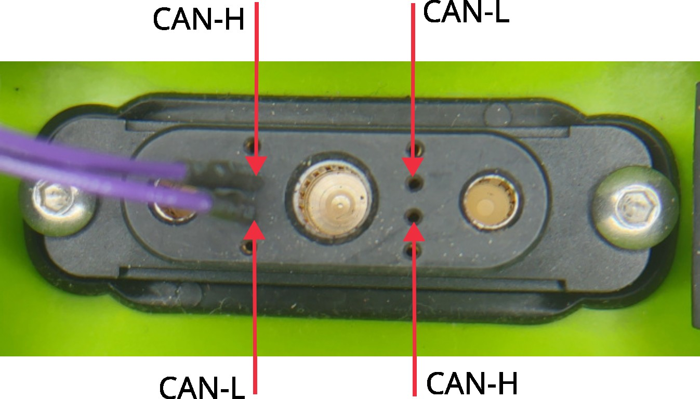
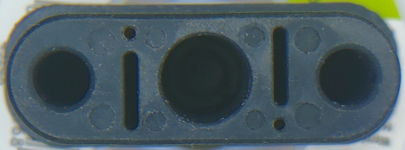

Kumpan Kraftpaket 2.0
=====================

Das Kumpan Kraftpaket ist der Akku der 2. Generation der Roller der Firma
Kumpan. Die Firma ging 2023 Insolvent, wurde aufgekauft aber defakto hat der
support für die Roller und auch die Akkus durch die Firma Kumpan geendet.

Aktuell sind informationen für die Akkus eher rar und über verschiedenste Quellen
im Internet Verteilt und leider schlecht aufzufinden.

Hier geht es darum den im Deckel des Akkus verbauten Microcontroller, samt LTE
Modul, GPS Empfänger zu reverse Engineeren. Dieser Microcontroller wurde dazu
verwendet Fernwartung auf den Akku und auch auf den Gesamten Roller zu machen,
wie auch Telemetriedaten des Rollers rauszusenden die über die Handy App
einsehbar waren.

Hardware
========

Im Deckel sind 2-4 Platinen verbaut je nachdem was man zählt. Es gibt das Display
und die LEDs die direkt vom Batterie Management System (BMS) angesteuert werden. Diese
interessieren uns aktuell nicht.

Daneben sind eine kleine Platine mit einem Microcontroller, einem Bluetooth Low Energy Modul,
einem LTE Modul verbaut. Dieses wird ergänzt mit einem einem GPS Empfänger und einer LTE Antenne
die jeweils über Kabel angebunden sind.

Microcontroller
===============

Hardware
--------

Die großen Bauteile sind:

* Microcontroller: Texas Instruments (TI) TM4C123x
* LTE Module: Telit GE866-QUAD
* Bluetooth Low Energy Modul: Telit BlueMod S42
* GPS Empfänger: Telit SC872-A
* NXP TJA1145: Accelerometer
* TI TPS7A89: Low Drop Voltage Regulator

Für die Stromversorgung auf dem Microcontroller Board wird ein 
[LT8631 von Analog Devices](https://www.analog.com/en/products/lt8631.html)
benutzt. Dieser hat eine Eingangsspannung von 3-100V und wird vermutlich direkt
mit der Akkuspannung von ~50V gespeist. Das Board läuft aber problemlos mit 12V
auf dem Schreibtisch. Für weitere Spannungen ist ein TI TPS7A89 verbaut.

Schnittstellen
--------------

Als Schnittstellen zu den einzelnen Peripherien kommt zum Einsatz:

- CAN Bus für das BMS und vermutlich den gesamten Roller
- Seriell/UART für das GPS auf dem 4 Pin Stecker inkl. Stromversorgung
- Seriell/UART für das BLE 
- Seriell/UART für das LTE 
- Einige GPIOs, vermutlich um Bauteile "powercyclen" zu können. So findet
  sich GPIO handling in der Software für den CAN Bus und im LTE teil
- Der 10 Polige 0.1" Raster Anschluss ist ein standard Cortex-M JTAG
- 11 Pin Anschluss zum BMS 

GPS
===

Das GPS ist vermutlich der einfachste Teil. Es ist separat über ein Kabel mit
+5V, GND, TX und RX angebunden. Das Pinout des Steckers findet sich in 
der Telit Dokumentation. Das Modul ist unverändert verbaut.

Nach dem Power-On initialisiert der Controller das GPS mit ein paar AT Befehlen, 
danach sendet das GPS regelmäßig NMEA Telegramme über Position, Satteliten etc.

Initialisierung
---------------

    $PMTK314,0,1,0,1,0,0,0,0,0,0,0,0,0,0,0,0,0,0,0,0,0*28
    $PMTK386,0*23
    $PMTK225,8*23

Die entsprechenden Commands finden sich in der Telit Doku, sind
aber auch bei anderen GPS Chipsets üblich:

* PMTK314 PMTK_API_SET_NMEA_OUTPUT

* PMTK 386 PMTK_SET_Nav Speed threshold 
  Nav Speed Threshold 0 -> Disable

* PMTK 225 PMTK_CMD_PERIODIC_MODE
  8 -> AlwaysLocate standby mode

Bluetooth Low Energy
====================

Ich habe bisher keine wirkliche funktion für das Bluetooth finden können. Das Modul
wird initialisiert, es gibt einen Bluetooth Task der läuft.

Initialisierung
---------------

So weit ich gefunden habe wird im BLE Task einfach nur der Name des BLE Moduls initialisiert
so das dieses "discoverable" ist.

    AT+BNAME=$akkuserial$

Diesen kann man dann pairen - Als device name taucht die seriennummer des Akkus auf.

CAN Bus
=======

Ich habe den CAN Bus mit einem [Waveshare USB CAN Model A](https://www.waveshare.com/usb-can-a.htm) mitgeschnitten.

Die Bitrate des CAN Bus ist 250kbit/s.

CAN Messages
------------

| MsgID  | Origin   | Len | Description                                 |
|--------|----------|----:|---------------------------------------------|
| 0x0101 | Bat/Comm |     |                                             |
| 0x054x | Bat/Comm |  7  | Example:                                    |
|        |          |     | Frame ID: 0540, Data: 03 71 ea 99 46 d6 63  |
|        |          |     | Byte 0   - Unknown                          |
|        |          |     | Byte 1-4 - Serial Number                    |
|        |          |     | Byte 6   - Unknown                          |
|        |          |     | Byte 7   - Unknown                          |
| 0x0640 | Bat      |     |                                             |
| 0x0740 | Bat/Comm |  1  | Data 0x1 || 0x2                             |
| 0x0782 | Bat/Comm |  1  | Data 0x0 || 0x2                             |
| 0x0790 | Bat/Comm |  8  |                                             |

Steckerbelegung
===============

Der Kraftpaket und auch der Ladestecker sind identisch aufgebaut und Symmetrisch d.h. 
können gedreht werden. Dafür sind die inneren Datenpins gespiegelt d.h. rechts und links
identisch. Der CAN (Controller Area Network) Bus ist ein differentieller Bus d.h. hat
eine High und eine Low Leitung.

Die 4 äusseren Pins werden vermutlich dazu verwendet festzustellen ob ein Akku gesteckt
ist. So hat der Blindstecker für nicht genutzte Akkusteckplätze nur jeweils diagonal 
gegenüber liegende Pins bestückt. 

